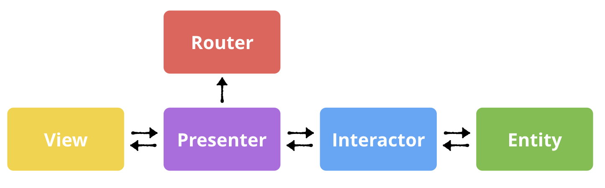

# Viper-SwiftUI

## About

A simple application that implements a pure VIPER architectural pattern.

VIPER offers an alternative to this scenario and can be used in conjunction with SwiftUI and Combine to help build apps with a clean architecture that effectively separates the different functions and responsibilities required, such as the user interface, business logic, data storage and networking.

### Scructure of the VIPER:

Each of the letters in VIPER stand for a component of the architecture: View, Interactor, Presenter, Entity and Router.

- The View is the user interface. This corresponds to a SwiftUI View.
- The Interactor is a class that mediates between the presenter and the data. It takes direction from the presenter.
- The Presenter is the “traffic cop” of the architecture, directing data between the view and interactor, taking user actions and calling to router to move the user between views.
- An Entity represents application data.
- The Router handles navigation between screens. 

 

### Screenshots:

 
 
 

